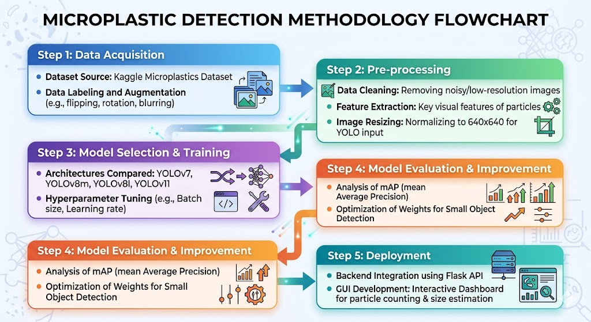
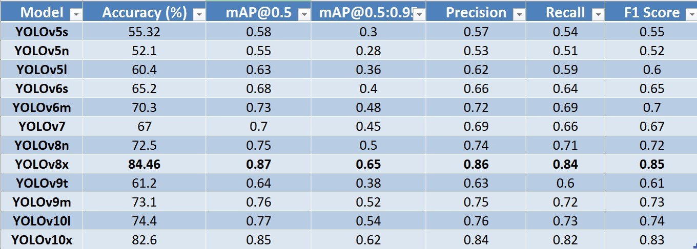

# Microplastic Detection & Quantification System 🌊🔬

## Project Overview
This project is an inter-disciplinary collaboration with the **Civil Engineering Department** aimed at automating the detection and analysis of microplastics in water samples. Using **YOLOv8**, the system identifies microplastics, provides spatial localization, and enables quantification for environmental research.

## Key Features
- **Object Detection:** Precise localization of microplastic particles in aquatic samples.
- **Particle Quantification:** Automatic counting and size estimation of detected particles.
- **Statistical Output:** Calculates the average size and distribution across multiple images.
- **Efficiency:** Replaces manual counting methods, significantly reducing analysis time for researchers.

## 🛠️ Technical Stack
- **Model Architecture:** YOLOv8 (Optimized for small object detection)
- **Language:** Python
- **Libraries:** Ultralytics, OpenCV, NumPy, Matplotlib

## 📊 Methodology & Results
The system follows a standard AI pipeline: Pre-processing water sample imagery, performing high-precision inference, and post-processing for size estimation.

*(Insert your Methodology Diagram here)*

*(Insert your Results Diagram/Table here)*

## 📂 Repository Contents
- `app.py`: Main script for model inference and analysis.
- `uploads/`: Directory containing sample test images.
- `best_microplastic_model.pt`: Pre-trained YOLOv8 weights (optimized for microplastics).
- `docs/`: Technical diagrams and performance reports.

---
**Developed by Umar Ayoub**
*Final Year Computer Science (AI) - UET Mardan*